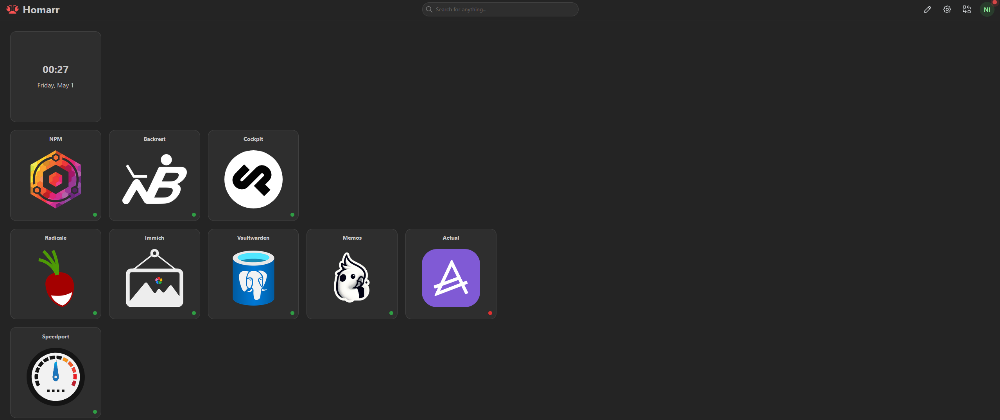

# Homarr

Homarr serves as a central dashboard, displaying all services in one place
without having to remember IPs or, in my case, subdomains.
It is accessible via [nicoshl.de](http://nicoshl.de) (pointing to 192.168.1.250)
and is set as my default Firefox start page.
I mostly use the default settings as I prefer functionality over customization.

