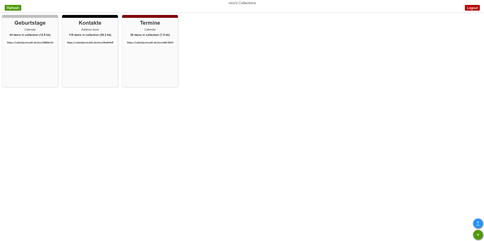

# Radicale

Radicale is used to sync contacts and calendars via CardDAV/CalDAV clients.
In the web interface you can create calendar and contact collections.
Note that you cannot manage the content of your collections through the web
interface — you need to use dedicated clients for that.

On PC, I use [Thunderbird](https://www.thunderbird.net) to access and edit my
calendar by adding it as a calendar server.
On my phone, I automatically sync my Samsung Calendar and contacts to my server
using the [DAVx⁵](https://www.davx5.com/) app.
Although the app is paid on the Play Store, you can download it for free
(legally) from F-Droid.

## Setup

### Step 1
Access your Radicale web interface and create your collections. In my case I
created one for birthdays, one for appointments and one for contacts.
You can assign colors to collections, which may appear in your client apps.

### Step 2
Either copy the individual URLs from the Radicale interface if you only want
to access specific collections, or set up your base URL manually:
`http(s)://your-ip-or-domain/your-user`

Add your chosen URL to a client of your choice. In my case I use DAVx⁵ for
mobile and Thunderbird for desktop.

### Step 3 (DAVx⁵ only)
**Contacts:**
Open your contacts app and select your default storage location.
Next, import your contacts — this should be possible via a VCF file in the
web interface, but in my case it did not work. I imported my contacts using
the Samsung Contacts import method directly into the DAVx⁵ client.

**Calendar:**
The DAVx⁵ app and its calendar collections should automatically appear in
your calendar app after the first sync.

